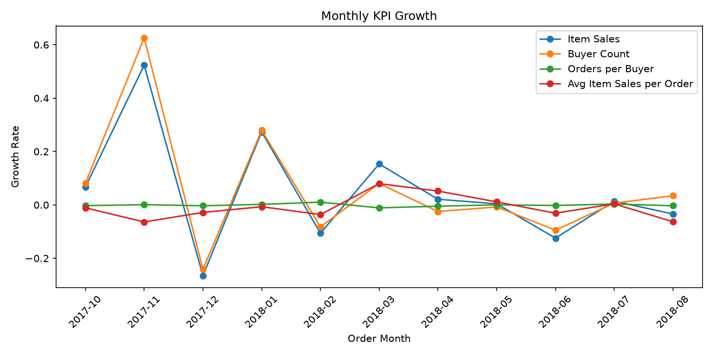
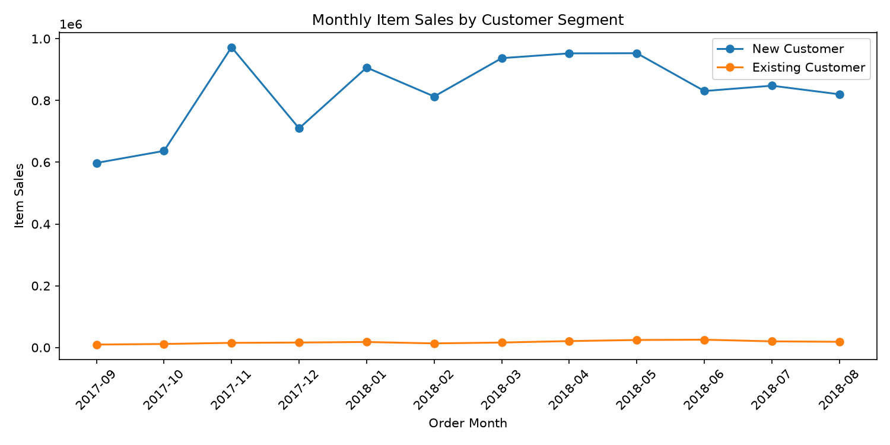
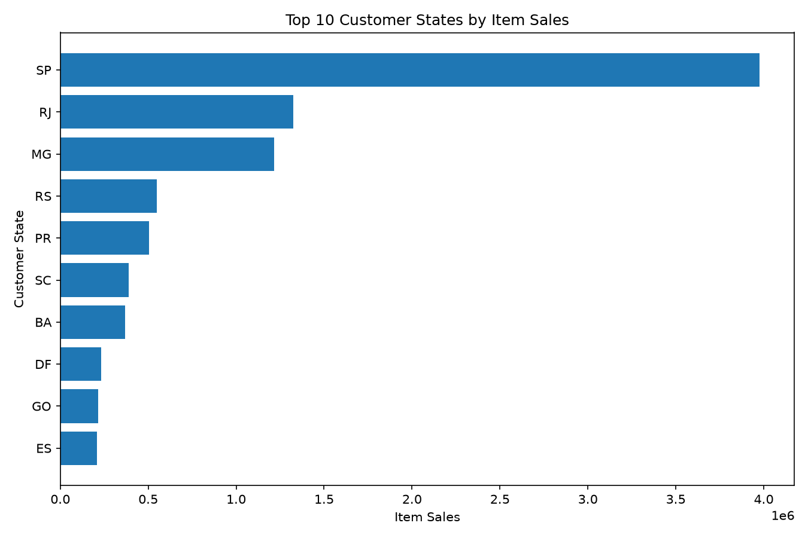

# Olist Sales Analysis

Brazilian E-Commerce Public Dataset by Olist를 활용하여  
최근 완전 12개월의 상품 판매금액(Item Sales) 변화를 분석한 포트폴리오 프로젝트입니다.

단순히 월별 판매금액의 증감만 확인하는 것이 아니라,

- Buyer Count
- Orders per Buyer
- Average Item Sales per Order
- Product Category
- Customer Lifecycle
- Customer Region

관점으로 판매 변화를 분해하고,  
다음 운영 기간의 우선 관리 대상을 제안하는 것을 목표로 했습니다.

---

## 1. Project Goal

이 프로젝트의 핵심 질문은 다음과 같습니다.

1. 월별 Item Sales는 어떻게 변화했는가?
2. Item Sales 변화는 Buyer Count, 구매 빈도, 주문당 판매금액 중 어디에서 나타났는가?
3. 어떤 상품 카테고리에서 변화가 크게 나타났는가?
4. 신규 고객과 기존 고객의 판매 기여는 어떻게 다른가?
5. 고객 지역별 판매 구조에는 어떤 차이가 있는가?
6. 다음 운영 기간에는 무엇을 유지하고, 무엇을 우선 점검해야 하는가?

---

## 2. Key Results

### Monthly Sales

2017년 11월 Item Sales는 전월 대비 **52.4% 증가**했으며,  
같은 기간 Buyer Count는 **62.6% 증가**했습니다.

2017년 12월 Item Sales는 전월 대비 **26.5% 감소**했으며,  
Buyer Count도 **24.1% 감소**했습니다.

Orders per Buyer와 Average Item Sales per Order의 변화보다  
Buyer Count 변화가 Item Sales 변화와 더 크게 함께 나타났습니다.



### Customer Lifecycle

분석기간 전체 고유 Buyer 중  
관측 가능한 최초 구매가 분석기간 내에 발생한 신규 고객 비중은 **99.23%**였습니다.

90일을 온전히 관찰할 수 있는 신규 고객은 **54,038명**이었으며,  
이 중 **693명**이 첫 구매 후 90일 이내 다시 구매했습니다.

따라서 관찰된 **90일 재구매율은 1.28%**였습니다.



### Product Category

전체 분석기간 Item Sales 상위 카테고리는 다음과 같습니다.

1. health_beauty
2. watches_gifts
3. bed_bath_table
4. sports_leisure
5. computers_accessories

상위 5개 카테고리는 전체 Item Sales의 약 **40.5%**를 차지했습니다.

2017년 11월 증가에서는

- bed_bath_table
- health_beauty
- furniture_decor
- watches_gifts
- toys

의 판매금액 증가폭이 크게 나타났습니다.

2017년 12월 감소에서는

- bed_bath_table
- computers_accessories
- furniture_decor
- watches_gifts
- cool_stuff

의 감소폭이 크게 나타났습니다.

### Customer Region

고객 지역별 Item Sales는 **SP**에 가장 크게 집중되었습니다.

SP는 전체 Item Sales의 **39.03%**를 차지했으며,  
Item Sales 상위 5개 State는 전체의 **74.32%**를 차지했습니다.



SP의 판매 규모가 큰 것은 고객당 Item Sales가 특별히 높아서라기보다  
큰 Buyer 기반과 함께 나타난 결과로 해석했습니다.

---

## 3. Business Priorities

### Maintain

다음 운영 기간에도 대규모 판매 기반을 가진 **SP**와  
주요 Item Sales 상위 상품 카테고리를 핵심 모니터링 대상으로 유지합니다.

주요 카테고리:

- health_beauty
- watches_gifts
- bed_bath_table

단순한 판매금액뿐 아니라  
Buyer Count와 월별 변동성도 함께 확인해야 합니다.

### Recovery Review

2017년 12월에는 전체 Item Sales가 크게 감소했습니다.

지역과 상품 카테고리를 교차 분석한 결과  
**SP × bed_bath_table** 조합을 우선 점검 대상으로 선정했습니다.

전체 지역이나 상품을 일괄적으로 대응하기보다,  
State × Product Category 기준으로 절대 감소폭이 큰 조합부터  
원인을 점검하는 것이 적절하다고 판단했습니다.

### Validate

현재 데이터에서는 신규 고객 의존도가 매우 높고  
90일 재구매율은 **1.28%**로 관찰되었습니다.

하지만 이 결과만으로 고객 유지 전략이나 CRM의 성과를 판단할 수는 없습니다.

따라서 다음 단계에서는

- 첫 구매월 Cohort
- Product Category
- Customer Region

기준으로 90일 재구매율을 추가 분해하여  
상대적으로 반복 구매 가능성이 높은 고객군이 존재하는지 검증할 필요가 있습니다.

---

## 4. Data Source

**Brazilian E-Commerce Public Dataset by Olist**

- Real commercial ecommerce data
- Anonymized
- Original data period: 2016–2018
- Source: Kaggle / Olist
- License: CC BY-NC-SA 4.0

Raw data is not included in this repository.

분석에 필요한 원본 파일과 저장 위치는  
[`data/README.md`](data/README.md)를 참고합니다.

---

## 5. Analysis Scope

### Analysis Period

```text
2017-09-01 <= order_purchase_timestamp < 2018-09-01
```

2018년 9월 이후 데이터는 월 전체가 충분히 관찰되지 않아  
최근 완전 12개월 분석에서 제외했습니다.

### Included Orders

```text
order_status = delivered
```

### Customer Key

```text
customer_unique_id
```

`customer_id`는 주문과 고객 테이블 연결에 사용하고,  
동일 실제 고객의 반복 구매를 식별할 때는 `customer_unique_id`를 사용했습니다.

### Item Sales

```text
Item Sales = SUM(order_items.price)
```

`freight_value`는 Item Sales에 포함하지 않고 별도로 관리했습니다.

Olist 데이터에는 명시적인 할인액과 실제 환불 금액이 없으므로  
본 프로젝트의 Item Sales는 회계적 의미의 Net Sales가 아닙니다.

---

## 6. Core Metrics

### Item Sales

```text
SUM(item_sales)
```

### Order Count

주문 단위 분석 테이블에서:

```text
COUNT(*)
```

### Buyer Count

```text
COUNT(DISTINCT customer_unique_id)
```

### Average Item Sales per Order

```text
Item Sales / Order Count
```

### Orders per Buyer

```text
Order Count / Buyer Count
```

### Item Sales Decomposition

```text
Item Sales
=
Buyer Count
× Orders per Buyer
× Average Item Sales per Order
```

### 90-day Repeat Rate

```text
첫 구매 후 1~90일 이내 다시 구매한 고객
────────────────────────────
90일을 온전히 관찰할 수 있는 신규 고객
```

---

## 7. Analysis Workflow

프로젝트는 다음 순서로 진행했습니다.

```text
Data Selection
        ↓
Data Quality Validation
        ↓
CSV → SQLite
        ↓
Analysis Table Construction
        ↓
Monthly KPI Analysis
        ↓
Product Category Analysis
        ↓
Customer Lifecycle Analysis
        ↓
Customer Region Analysis
        ↓
State × Category Validation
        ↓
Business Recommendation
```

### Analysis Tables

#### Item-level

```text
analysis_order_items
```

Grain:

```text
1 row = 1 order_id × order_item_id
```

상품 카테고리 분석과 State × Category 분석에 사용했습니다.

#### Order-level

```text
analysis_orders
```

Grain:

```text
1 row = 1 order_id
```

월별 KPI와 고객 지역 분석에 사용했습니다.

---

## 8. Repository Structure

```text
01_sales_analysis/
│
├── data/
│   └── README.md
│
├── docs/
│   ├── analysis_plan.md
│   ├── business_recommendations.md
│   ├── category_findings.md
│   ├── customer_findings.md
│   ├── data_dictionary.md
│   ├── data_quality_report.md
│   ├── data_selection.md
│   ├── monthly_kpi_findings.md
│   ├── problem_statement.md
│   ├── region_findings.md
│   └── reproducibility_check.md
│
├── notebooks/
│   ├── 01_data_check.ipynb
│   ├── 02_build_olist_sqlite.ipynb
│   ├── 03_monthly_kpi_analysis.ipynb
│   ├── 04_category_performance_analysis.ipynb
│   ├── 05_customer_segment_analysis.ipynb
│   └── 06_customer_region_analysis.ipynb
│
├── reports/
│   ├── figures/
│   ├── final_report.md
│   └── analysis result CSV files
│
├── sql/
│   ├── 01_build_sales_analysis_tables.sql
│   ├── 02_monthly_kpi.sql
│   ├── 03_category_performance.sql
│   ├── 04_customer_segments.sql
│   ├── 05_customer_region.sql
│   └── 06_business_priority_validation.sql
│
├── .gitignore
├── README.md
└── requirements.txt
```

---

## 9. How to Reproduce

### 1. Clone Repository

```powershell
git clone https://github.com/mingeon-t4r/01_sales_analysis.git
cd 01_sales_analysis
```

### 2. Create Python Environment

```powershell
python -m venv .venv
.venv\Scripts\activate
```

### 3. Install Packages

```powershell
python -m pip install -r requirements.txt
```

### 4. Prepare Raw Data

Olist 데이터에서 다음 파일을 준비합니다.

```text
olist_customers_dataset.csv
olist_orders_dataset.csv
olist_order_items_dataset.csv
olist_products_dataset.csv
product_category_name_translation.csv
```

다음 위치에 저장합니다.

```text
data/raw/olist/
```

상세 내용:

```text
data/README.md
```

### 5. Run Data Check

```text
notebooks/01_data_check.ipynb
```

### 6. Build SQLite Database

```text
notebooks/02_build_olist_sqlite.ipynb
```

생성되는 로컬 DB:

```text
data/processed/olist.db
```

### 7. Build Analysis Tables

DB Browser for SQLite 또는 SQLite 실행 환경에서:

```text
sql/01_build_sales_analysis_tables.sql
```

을 실행합니다.

### 8. Run Analysis Notebooks

다음 순서대로 실행합니다.

```text
03_monthly_kpi_analysis.ipynb
04_category_performance_analysis.ipynb
05_customer_segment_analysis.ipynb
06_customer_region_analysis.ipynb
```

각 Notebook은 가능하면:

```text
Restart & Run All
```

로 전체 실행합니다.

### 9. Run Business Priority Validation

```text
sql/06_business_priority_validation.sql
```

을 실행하여 State × Product Category 변화 결과를 확인합니다.

---

## 10. Reproducibility Check

재실행 후 다음 핵심 값이 기존 분석 결과와 일치하는지 확인합니다.

```text
2017-11 Item Sales
= 987,765.37
```

```text
2017-12 Item Sales
= 726,033.19
```

```text
Eligible 90-day New Customers
= 54,038
```

```text
90-day Repeat Customers
= 693
```

```text
90-day Repeat Rate
= 1.28%
```

```text
SP Item Sales
= 3,976,325.47
```

상세 재현성 점검 결과는:

```text
docs/reproducibility_check.md
```

에 기록합니다.

---

## 11. Limitations

본 분석에는 다음과 같은 한계가 있습니다.

- Item Sales는 회계적 Net Sales가 아닙니다.
- 명시적인 할인액과 실제 환불 금액을 확인할 수 없습니다.
- 상품 원가와 마진 데이터가 없습니다.
- 광고비와 고객 획득 채널을 확인할 수 없습니다.
- 프로모션과 쿠폰 노출 정보를 확인할 수 없습니다.
- 상품 재고 상태를 확인할 수 없습니다.
- First Purchase는 실제 생애 최초 구매가 아니라 데이터에서 관측 가능한 최초 구매입니다.
- 데이터 시작 이전의 고객 구매 이력은 알 수 없습니다.
- 계절성 및 외부 환경 요인을 직접 분리하지 않았습니다.
- 관찰된 관계만으로 인과관계를 판단할 수 없습니다.

따라서 본 프로젝트의 Business Recommendation은  
즉각적인 정책 실행 지시라기보다 **우선 점검 및 추가 검증 대상의 제안**으로 해석해야 합니다.

---

## 12. Detailed Documentation

분석 단계별 상세 내용은 다음 문서에서 확인할 수 있습니다.

- [Problem Statement](docs/problem_statement.md)
- [Data Selection](docs/data_selection.md)
- [Data Dictionary](docs/data_dictionary.md)
- [Data Quality Report](docs/data_quality_report.md)
- [Monthly KPI Findings](docs/monthly_kpi_findings.md)
- [Category Findings](docs/category_findings.md)
- [Customer Findings](docs/customer_findings.md)
- [Region Findings](docs/region_findings.md)
- [Business Recommendations](docs/business_recommendations.md)
- [Reproducibility Check](docs/reproducibility_check.md)
- [Final Report](reports/final_report.md)

---

## 13. Project Status

✅ **Portfolio Project v1.0 Completed**