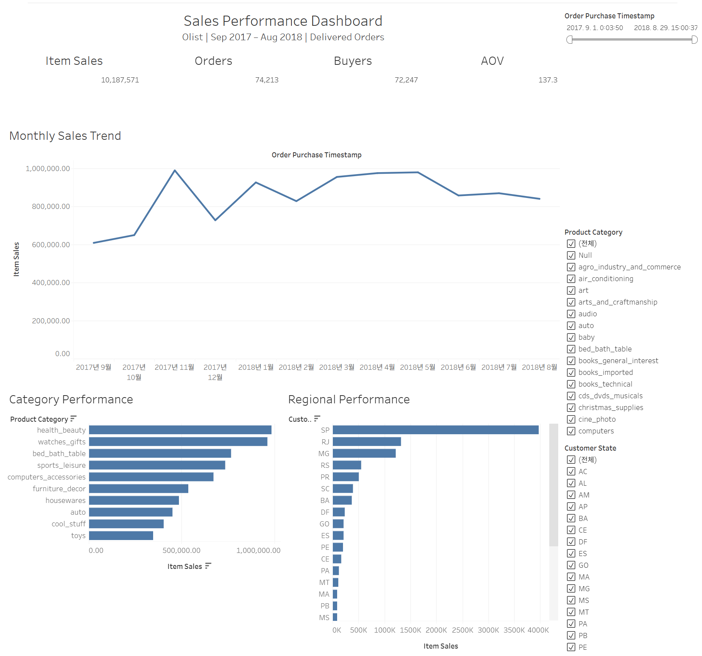

# Tableau 대시보드

## 대시보드

**Olist Sales Performance Dashboard**

Olist 이커머스 데이터를 기반으로
최근 완전 12개월의 판매 성과와 고객 KPI를 모니터링하고,
기간·지역·상품 카테고리별 성과 변화를 탐색할 수 있도록
구성한 Tableau 대시보드입니다.

## 분석 목적

다음 질문에 답할 수 있도록 구성했습니다.

- 전체 Item Sales는 어느 정도인가?
- 주문 수와 구매 고객 수는 어떻게 변화했는가?
- 월별 판매 성과는 어떻게 변화했는가?
- 어떤 상품 카테고리의 판매 기여가 큰가?
- 어떤 지역의 판매 규모가 큰가?

## Tableau 데이터

데이터 원본:

`tableau_analysis_order_items.csv`

데이터 단위:

`1행 = 1 order_id × order_item_id`

분석 기간:

`2017-09-01 <= order_purchase_timestamp < 2018-09-01`

포함 주문:

`order_status = delivered`

Tableau용 CSV는 기존 SQL 분석 테이블을
Tableau에서 사용할 수 있도록 Export한 데이터이며
Git 저장소에는 포함하지 않습니다.

## 주요 KPI

- Item Sales
- Order Count
- Buyer Count
- Average Item Sales per Order

주문 수와 고객 수는 item-level 데이터의 중복을 방지하기 위해
각각 `COUNTD(order_id)`,
`COUNTD(customer_unique_id)`를 사용합니다.

## 주요 시각화

- Monthly Sales Trend
- Category Performance
- Regional Performance

Category Performance는
Item Sales 기준 상위 10개 카테고리를 표시합니다.

## Dashboard Filter

- 주문 기간
- Customer State
- Product Category

Product Category 선택 Filter와
Category Performance의 Top 10 Filter는
서로 다른 목적으로 분리하여 사용합니다.

## 검증

기존 SQL/Python 분석 결과와 Tableau 결과를 비교했습니다.

- 전체 KPI: PASS
- 월별 KPI: PASS
- 카테고리 성과: PASS
- 지역 성과: PASS

## Dashboard 이미지

## Tableau Public

[Tableau Public에서 대시보드 보기](https://public.tableau.com/views/OlistSalesPerformanceDashboard/SalesPerformanceDashboard?:language=ko-KR&:sid=&:redirect=auth&:display_count=n&:origin=viz_share_link)

## Workbook

`./sales_performance_dashboard.twb`